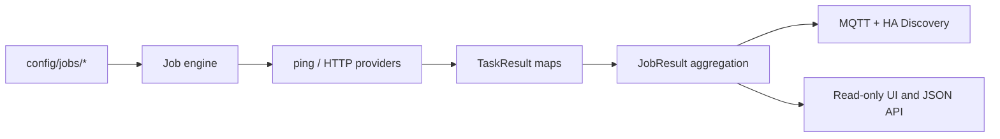

# Home Infra Agent

A small, configuration-driven collector for operational state that is useful in Home Assistant. Jobs are independent filesystem units; tasks are generic operations; results remain normalized data until the MQTT adapter publishes them.



## Run locally

Requires Python 3.11+, `ping` from iputils, and (for MQTT) access to a broker.

```sh
python -m venv .venv
. .venv/bin/activate
pip install -e '.[test]'
HIA_CONFIG_DIR="$PWD/config" HIA_HOST=127.0.0.1 home-infra-agent
```

Open <http://127.0.0.1:8080>. The initial Proxmox job checks `home-lab-0` through `home-lab-2` at `192.168.1.51`–`.53`. The cloud VM must have a Tailscale/private route to `192.168.1.0/24`. The default web bind is loopback; put a private reverse proxy in front if remote UI access is needed.

## Configuration

Set `HIA_CONFIG_DIR` to the directory containing `application.yaml` and `jobs/`; defaults to `/etc/home-infra-agent`. `HIA_JOBS_DIR` can override the jobs path. Runtime state is held in memory and never written to config. A job is loaded from `jobs/<id>/job.yaml`; every other `*.yaml` in that directory is one task. A malformed job is reported but does not stop its siblings.

Example job:

```yaml
name: Proxmox Cluster
schedule:
  interval: 60s
timeout: 3s
mqtt:
  enabled: true
  topic: home/proxmox
  device:
    name: Proxmox Cluster
    manufacturer: Custom
    model: Proxmox Cluster
```

Example `nodes.yaml` task:

```yaml
type: ping
targets:
  home-lab-0: 192.168.1.51
  home-lab-1: 192.168.1.52
  home-lab-2: 192.168.1.53
```

HTTP tasks use `type: http`, `url: https://host/health`, and optionally `method` and `headers`. Task status is `OK`, `WARN`, `ERROR`, or `UNKNOWN`. Results carry a timestamp, duration, optional error, and a values map that supports native JSON booleans, numbers, strings, and timestamps. Job values include task-qualified keys plus unambiguous short keys.

The `kubernetes` task provider reads cluster nodes, pods, deployments, StatefulSets, and DaemonSets from the in-cluster Kubernetes API. It expects the standard projected service-account token and CA files and verifies the API certificate. The ops-autopilot chart enables this provider with a read-only ClusterRole limited to listing those five resource types; it never reads Secrets, ConfigMaps, logs, or Events. Outside Kubernetes, the task reports an error because no in-cluster service-account credentials are available.

The Solarman job polls the Cloud Open API every hour using the existing scheduler and MQTT discovery pipeline. Inject `SOLARMAN_APP_ID`, `SOLARMAN_APP_SECRET`, `SOLARMAN_EMAIL`, and `SOLARMAN_PASSWORD` through the deployment's secret environment mechanism (or an ignored local `.env` file); `SOLARMAN_DEVICE_SERIAL` is optional and is only needed when API discovery returns more than one device. Device selection is cached for the process lifetime; the API token is refreshed each run. Only allowlisted fields are published, and readings older than 900 seconds are marked stale with measurements omitted. The raw lifetime home-consumption counter is a cross-check only, not an Energy Dashboard source. Keep the HA Solarman integration enabled for side-by-side validation.

K3s workload health uses node readiness, controller availability, and pending, unknown, or running-but-not-ready pods. The `podsFailed` metric counts terminal failed Pod objects that remain in the API, but those retained historical objects alone do not mark current workloads degraded.

## MQTT and Home Assistant

Configure `mqtt.host`, `port`, optional `username`, `passwordEnv`, and `discoveryPrefix` in `application.yaml`. The password is resolved from the named environment variable at startup; do not put credentials in YAML or source control. The sample configuration disables MQTT until a broker is configured. Set `mqtt.enabled: true`, then provide `HIA_MQTT_PASSWORD` through systemd EnvironmentFile or your container secret mechanism. Keep the broker on a private network; this service does not expose it.

The adapter publishes retained discovery configs below `homeassistant/<component>/<stable-id>/config` and one retained JSON state per job at `<job mqtt topic>/state` (Proxmox: `home/proxmox/state`). Entities share one HA device identifier per job. Node UP/DOWN values become binary sensors; counts and other values become sensors. The first execution publishes the entities for values produced by that job. MQTT reconnect republishes discovery and the latest state. A retained Last Will availability topic reports agent online/offline; a broker will retain each job's latest state until a new result arrives.

The Proxmox device exposes a status, last-run timestamp, duration, each node's UP/DOWN value, `online`, and `total`. Job/Task providers have no Home Assistant dependency.

## API

- `GET /api/jobs` — discovered jobs and latest state
- `GET /api/jobs/{id}` — job details and latest normalized result
- `POST /api/jobs/{id}/run` — run one job immediately
- `GET /health` — process health and MQTT connection state

The web UI is server-rendered HTML with a small inline script. It is read-only except for the explicit Run now action; it does not edit configuration.

## Cloud VM deployment

Native systemd is the lightest route. Install the package into `/opt/home-infra-agent/.venv`, create a `home-infra-agent` system user, copy `config/` to `/etc/home-infra-agent/`, and install `deploy/home-infra-agent.service` into `/etc/systemd/system/`. Add a root-readable `/etc/home-infra-agent/secrets.env` such as `HIA_MQTT_PASSWORD=...` (mode 0600), enable with `systemctl enable --now home-infra-agent`, and inspect `journalctl -u home-infra-agent`. Ensure the VM's Tailscale ACL and routes allow ICMP to the home subnet. If ICMP is blocked, use a generic HTTP health task for reachable services.

Alternatively build the included Dockerfile and mount the config read-only at `/etc/home-infra-agent`; pass the MQTT password as a container secret/environment variable. The image includes iputils ping. For Docker networking, explicitly provide the private route/Tailscale sidecar or host networking as appropriate to the VM.

The process starts one lightweight scheduler thread per job, sleeps between runs, and uses bounded network timeouts. Idle resource use was not measured in this development environment; expect a modest Python service footprint, with CPU near idle between configured runs. Measure actual VM memory after deployment before setting limits.

## CI image and GitOps deployment

GitHub Actions runs the test suite on pull requests and pushes to `main`. After successful `main` validation, `.github/workflows/docker-publish.yml` builds and publishes `aserobaba/home-infra-agent` with `latest` and `sha-<commit>` tags, scans the pushed digest with Trivy, and uploads an SPDX SBOM. Configure repository secrets `DOCKERHUB_USERNAME` and `DOCKERHUB_TOKEN` for publishing. The ops-autopilot chart and dev Argo Application live in the adjacent `ops-autopilot` checkout under `applications/home-infra-agent/`; it mounts the Proxmox job configuration and allows private-subnet egress. Production deployment is not registered until a published digest is promoted through ops-autopilot's immutable-image workflow.

## Tests and current limits

Run `pytest`. Tests cover discovery, parsing, both providers, task isolation, aggregation, MQTT payload/discovery, invalid-job isolation, and manual execution. Current POC uses in-memory results only, has no authentication or historical store, does not hot-reload files, and supports only ping and HTTP. The sample network job has not been verified against the production hosts; keep the existing production monitor until the new service is proven on the VM and HA.

Recommended next milestone: deploy alongside the existing monitor on the private VM, verify route/ICMP and MQTT discovery in Home Assistant, then observe restart/reconnect behavior before considering production monitor retirement.
