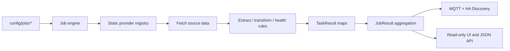

# Home Infra Agent

A small, configuration-driven collector for operational state that is useful in Home Assistant. Jobs are independent filesystem units; tasks are generic operations; results remain normalized data until the MQTT adapter publishes them.



## Run locally

Requires Python 3.11+, `ping` from iputils, and (for MQTT) access to a broker.

```sh
python -m venv .venv
. .venv/bin/activate
pip install -e '.[test]'
HIA_CONFIG_DIR="$PWD/config" HIA_HOST=127.0.0.1 home-infra-agent
```

Open <http://127.0.0.1:8080>. The initial Proxmox job checks `home-lab-0` through `home-lab-2` at `192.168.1.51`–`.53`. The cloud VM must have a Tailscale/private route to `192.168.1.0/24`. The default web bind is loopback; put a private reverse proxy in front if remote UI access is needed.

## Configuration

Set `HIA_CONFIG_DIR` to the directory containing `application.yaml` and `jobs/`; defaults to `/etc/home-infra-agent`. `HIA_JOBS_DIR` can override the jobs path. Runtime state is held in memory and never written to config. A job is loaded from `jobs/<id>/job.yaml`; every other `*.yaml` in that directory is one task. A malformed Job is reported but does not stop its siblings. Task files and schemas are validated during startup; an invalid Task is reported before its provider is called while its sibling Tasks and Jobs continue.

Example job:

```yaml
name: Proxmox Cluster
schedule:
  interval: 60s
timeout: 3s
mqtt:
  enabled: true
  topic: home/proxmox
  device:
    name: Proxmox Cluster
    manufacturer: Custom
    model: Proxmox Cluster
```

Example `nodes.yaml` task:

```yaml
type: ping
targets:
  home-lab-0: 192.168.1.51
  home-lab-1: 192.168.1.52
  home-lab-2: 192.168.1.53
```

Task status is `OK`, `WARN`, `ERROR`, or `UNKNOWN`. Results carry a timestamp, duration, optional error, and a values map that supports native JSON booleans, numbers, strings, and timestamps. Job values include task-qualified keys plus short keys only when that field occurs in one task. If two tasks return the same short field name, both qualified keys remain and the ambiguous alias is omitted regardless of task order. Runtime exception details are redacted from result payloads and logs; configuration validation errors remain descriptive.

## Configuration-first integrations

| Provider | Source | Generic extraction and health rules |
|---|---|---|
| `ping` | Bounded ICMP checks for configured targets | Rules can inspect `UP`/`DOWN`, `online`, and `total` |
| `http` | HTTP GET or POST, optional headers and bearer/basic auth | JSON extraction, primitive conversion, transformations, and health rules |
| `kubernetes` | In-cluster nodes, pods, and workload resources | Rules can inspect existing aggregate values |
| `investory_postgres` | Existing read-only Investory portfolio summary query | Rules can inspect existing normalized values |
| `solarman` | Existing authenticated Solarman Cloud API provider | Authentication, device selection, retry, field allowlist, and source freshness stay provider-owned; rules may inspect its normalized values |

The provider registry is deliberately static. Add Python provider code only when a source needs protocol-specific authentication, pagination, stateful selection, parsing, or recovery that is clearer inside a specialized provider than in the generic HTTP configuration. A provider returns primitive values; the existing result model, MQTT adapter, and UI handle the rest.

### HTTP requests

Without `extract`, an HTTP Task keeps the original health-check behavior and returns `reachable` and `statusCode`; 200–399 are expected by default. With extraction configured, the response must be JSON and is read only up to `maxResponseBytes` plus one byte. The default limit is 1 MiB; the allowed range is 1 byte to 5 MiB. The optional Task `timeout` overrides the Job timeout. `expectedStatusCodes` defaults to all 200–399 codes.

Methods `GET` and `POST` are supported. A POST `body` is encoded as JSON. `headers` must map strings to strings. Credentials are referenced through environment-variable names, not literal values:

```yaml
auth:
  type: bearer
  tokenEnv: EXAMPLE_SERVICE_API_TOKEN
```

Basic authentication is also supported:

```yaml
auth:
  type: basic
  usernameEnv: EXAMPLE_API_USER
  passwordEnv: EXAMPLE_API_PASSWORD
```

Missing variables produce a safe Task error naming the missing variable without exposing the credential. TLS verification stays enabled.

### JSON paths and extraction

`extract` maps output field names to a restricted path and type. Paths support the root `$`, object properties, and numeric array indices: `$`, `$.status.online`, `$.cluster.nodes.ready`, and `$.devices[0].temperature`. There are no wildcards, filters, expressions, templates, or executable code. Property names start with a letter or underscore and may then contain letters, digits, underscores, or hyphens.

Supported types are `string`, `integer`, `number`, `boolean`, and `timestamp`. Booleans accept JSON booleans and the strings `true`/`false` (case-insensitive). Integers reject fractional values. Numbers must be finite. Timestamps accept ISO date/time strings and normalize timezone-free values to UTC. Paths can traverse arrays and objects, but output values must be scalar or null.

Each extraction field supports:

- `required: true`: a missing or null path fails the Task. `required` cannot be combined with `default`.
- `default`: a scalar value or null to use when a path is missing. Without a default, missing optional fields are omitted. Explicit JSON null remains null.
- `map`: exact equality mapping after initial type conversion.
- `multiply`, `divide`, and `round`: numeric transformations in that order after mapping. Division by zero, non-finite results, and invalid integer conversions fail the Task.

Invalid paths, field types, options, and transformations are rejected at startup. Runtime conversion errors identify the output field without echoing the source value.

### Health rules

Optional `health.rules` are combined with AND and evaluated against extracted fields (or normalized provider values if there is no extraction). Operators are `equals`, `notEquals`, `greaterThan`, `lessThan`, `greaterThanOrEqual`, `lessThanOrEqual`, `equalsField`, and `exists`. Equality requires the same primitive type. A missing or null field fails a value comparison; `exists: false` passes only if the field is absent or null. `onFailure` may be `WARN` or `ERROR` and defaults to `ERROR`.

With no rules, provider status is unchanged. Passing rules return `OK` for a provider `OK`, while provider `WARN`, `ERROR`, and `UNKNOWN` keep their meaning. Failed rules return the configured failure status unless the provider already returned `ERROR` or `UNKNOWN`, which cannot be downgraded. Fetch, HTTP status, JSON parsing, and required-extraction failures become `ERROR` before health rules run.

### MQTT entities

`mqtt.entities` is optional. Without it, existing automatic discovery stays in effect: `UP`/`DOWN` values become binary sensors, and other values become sensors. Entries are keyed by exact output field names and support `name`, `component` (`sensor` or `binary_sensor`), `payload_on`, `payload_off`, `unit_of_measurement`, `unit_of_measurement_field`, `device_class`, `state_class`, `icon`, and `expire_after`. `payload_on`/`payload_off` require a binary sensor. Arbitrary per-entity state, discovery, or availability topics are not allowed. Entity metadata is checked during startup, including duplicate identifiers and built-in sensor collisions.

`unit_of_measurement_field` names another normalized value and resolves it as the unit (for example, the returned `baseCurrency`). This moves Investory’s currency presentation into YAML while preserving its existing monetary entities. The `equity`, `totalProfit`, and `snapshotDate` metadata now lives in the Investory Job configuration.

Stable discovery topics, unique IDs, device identifiers, state topics, field names, and current entity types are protected by golden tests. Explicit entity declarations are opt-in. Changing an existing field's `component` changes its discovery topic, so use component overrides for new fields or plan a deliberate HA entity migration. Existing retained discovery records are never deleted automatically.

### YAML-only HTTP example

[`config/examples/http-service`](config/examples/http-service) demonstrates HTTP GET, bearer auth, JSON extraction, conversions, mapping, numeric scaling, health rules, scheduling, freshness, and MQTT metadata. Replace the example URL with a reachable endpoint and configure `EXAMPLE_SERVICE_API_TOKEN` in the runtime secret environment. Copy the directory into `config/jobs/` to register it:

`job.yaml`:

```yaml
name: Example HTTP Service
schedule:
  interval: 60s
timeout: 5s
freshness:
  maxAge: 180s
mqtt:
  enabled: true
  topic: home/example-service
  device:
    name: Example HTTP Service
    manufacturer: Custom
    model: JSON status API
  entities:
    online: {name: API online, icon: mdi:web}
    nodeState: {name: Node state, component: binary_sensor, payload_on: UP, payload_off: DOWN}
    ready: {name: Ready nodes, unit_of_measurement: nodes, state_class: measurement}
    temperature: {name: Temperature, unit_of_measurement: "°C", device_class: temperature, state_class: measurement}
    humidity: {name: Humidity, unit_of_measurement: "%", device_class: humidity, state_class: measurement}
    updatedAt: {name: API updated, device_class: timestamp}
```

`health.yaml`:

```yaml
type: http
url: https://service.internal/api/status
method: GET
timeout: 5s
headers:
  Accept: application/json
auth:
  type: bearer
  tokenEnv: EXAMPLE_SERVICE_API_TOKEN
expectedStatusCodes: [200]
maxResponseBytes: 1048576
extract:
  online: {path: $.status.online, type: boolean, required: true}
  ready: {path: $.cluster.ready, type: integer, required: true}
  total: {path: $.cluster.total, type: integer, required: true}
  nodeState:
    path: $.node.state
    type: string
    map: {ready: UP, offline: DOWN}
  temperature:
    path: $.sensor.temperature_centi
    type: number
    multiply: 0.01
    round: 1
  humidity: {path: $.sensor.humidity, type: number, default: null}
  updatedAt: {path: $.meta.updatedAt, type: timestamp, required: true}
health:
  rules:
    - {field: online, equals: true}
    - {field: ready, equalsField: total}
    - {field: nodeState, equals: UP}
  onFailure: WARN
```

```sh
cp -R config/examples/http-service config/jobs/example-service
```

After restart, the Job appears in the UI and its declared entities publish through the existing MQTT adapter. The example is not deployed automatically.

### Troubleshooting

- **A Job or Task is rejected at startup:** use the log's Job/Task and field name to check YAML structure, provider type, extraction path, timeout, or metadata.
- **Missing environment variable:** configure the named variable in the systemd EnvironmentFile or container secret environment and restart the agent.
- **Unexpected HTTP status or invalid JSON:** verify the endpoint response and `expectedStatusCodes`; response bodies are not included in error messages.
- **Oversized response:** raise `maxResponseBytes` only as needed, up to 5 MiB, or use a narrower endpoint.
- **Unavailable MQTT entity:** check Job status, broker connection, `freshness.maxAge`, and entity `expire_after`.
- **No discovered entity:** ensure the extraction output field exactly matches `mqtt.entities` and that its discovery slug does not collide with another field or built-in Job sensor.

The `kubernetes` task provider reads cluster nodes, pods, deployments, StatefulSets, and DaemonSets from the in-cluster Kubernetes API. It expects the standard projected service-account token and CA files and verifies the API certificate. The ops-autopilot chart enables this provider with a read-only ClusterRole limited to listing those five resource types; it never reads Secrets, ConfigMaps, logs, or Events. Outside Kubernetes, the task reports an error because no in-cluster service-account credentials are available.

The Solarman job polls the Cloud Open API every hour using the existing scheduler and MQTT discovery pipeline. Inject `SOLARMAN_APP_ID`, `SOLARMAN_APP_SECRET`, `SOLARMAN_EMAIL`, and `SOLARMAN_PASSWORD` through the deployment's secret environment mechanism (or an ignored local `.env` file); `SOLARMAN_DEVICE_SERIAL` is optional and is only needed when API discovery returns more than one device. Device selection is cached for the process lifetime; the API token is refreshed each run. Only allowlisted fields are published, and readings older than 900 seconds are marked stale with measurements omitted. The raw lifetime home-consumption counter is a cross-check only, not an Energy Dashboard source. Keep the HA Solarman integration enabled for side-by-side validation.

K3s workload health uses node readiness, controller availability, and pending, unknown, or running-but-not-ready pods. The `podsFailed` metric counts terminal failed Pod objects that remain in the API, but those retained historical objects alone do not mark current workloads degraded.

## MQTT and Home Assistant

Configure `mqtt.host`, `port`, optional `username`, `passwordEnv`, and `discoveryPrefix` in `application.yaml`. The password is resolved from the named environment variable at startup; do not put credentials in YAML or source control. The sample configuration disables MQTT until a broker is configured. Set `mqtt.enabled: true`, then provide `HIA_MQTT_PASSWORD` through systemd EnvironmentFile or your container secret mechanism. Keep the broker on a private network; this service does not expose it.

The adapter publishes retained discovery configs below `homeassistant/<component>/<stable-id>/config` and one retained JSON state per job at `<job mqtt topic>/state` (Proxmox: `home/proxmox/state`). Existing discovery topic paths, unique IDs, device identifiers, state topics, field names, and entity types are retained; the `tests/fixtures/mqtt_discovery_baseline.json` golden fixture protects the current Proxmox, Investory, and Solarman entity configs. Two additional job sensors report last successful execution and result freshness. Entities share one HA device identifier per job. Node UP/DOWN values become binary sensors; counts and other values become sensors. A single publisher worker keeps MQTT I/O out of Job execution and coalesces pending results per job. Unchanged discovery payloads are not resent during ordinary runs; reconnect forces discovery replay and republishes each latest result.

Agent availability is separate from Job status and freshness. The retained Last Will reports the agent offline if its broker connection drops; clean shutdown publishes retained `offline`. Each configured job has a `freshness.maxAge` and its entities use the same MQTT expiry. A failed or stale run clears previously known values from the retained state; freshness is calculated from the last successful `OK` or `WARN` result, while top-level `ERROR`, `WARN`, and Solarman's own `source_status: STALE` remain distinct. The currently configured policies are 180 seconds for Proxmox, 72 hours for the weekday Investory job, and 2 hours for Solarman. Jobs without this optional setting keep working and report freshness as `UNKNOWN`.

The Proxmox device exposes a status, last-run timestamp, duration, each node's UP/DOWN value, `online`, and `total`. Job/Task providers have no Home Assistant dependency.

## API

- `GET /api/jobs` — discovered jobs and latest state
- `GET /api/jobs/{id}` — job details and latest normalized result
- `POST /api/jobs/{id}/run` — run one job immediately
- `GET /health` — process health and MQTT connection state

The web UI is server-rendered HTML with a small inline script. Untrusted job names and result data are inserted with DOM `textContent`, not HTML parsing. The Run now endpoint requires a matching `Origin` (or same-origin `Referer`) and returns HTTP 409 if that Job is already active. It is read-only except for the explicit Run now action; it does not edit configuration.

Each Job has a non-blocking execution lock shared by scheduled and manual runs. A run already in progress is skipped by the scheduler and rejected with HTTP 409 for a manual request; different Jobs can run concurrently. Ping checks use at most eight workers and a bounded wait, preserving `UP`, `DOWN`, `online`, and `total` result meanings.

## Cloud VM deployment

Native systemd is the lightest route. Install the package into `/opt/home-infra-agent/.venv`, create a `home-infra-agent` system user, copy `config/` to `/etc/home-infra-agent/`, and install `deploy/home-infra-agent.service` into `/etc/systemd/system/`. Add a root-readable `/etc/home-infra-agent/secrets.env` such as `HIA_MQTT_PASSWORD=...` (mode 0600), enable with `systemctl enable --now home-infra-agent`, and inspect `journalctl -u home-infra-agent`. Ensure the VM's Tailscale ACL and routes allow ICMP to the home subnet. If ICMP is blocked, use a generic HTTP health task for reachable services.

Alternatively build the included Dockerfile and mount the config read-only at `/etc/home-infra-agent`; pass the MQTT password as a container secret/environment variable. The image includes iputils ping. For Docker networking, explicitly provide the private route/Tailscale sidecar or host networking as appropriate to the VM.

The process starts one lightweight scheduler thread per job, sleeps between runs, and uses bounded network timeouts. Idle resource use was not measured in this development environment; expect a modest Python service footprint, with CPU near idle between configured runs. Measure actual VM memory after deployment before setting limits.

## CI image and GitOps deployment

GitHub Actions runs the test suite on pull requests and pushes to `main`. After successful `main` validation, `.github/workflows/docker-publish.yml` builds and publishes `aserobaba/home-infra-agent` with `latest` and `sha-<commit>` tags, scans the pushed digest with Trivy, and uploads an SPDX SBOM. Configure repository secrets `DOCKERHUB_USERNAME` and `DOCKERHUB_TOKEN` for publishing. The ops-autopilot chart and dev Argo Application live in the adjacent `ops-autopilot` checkout under `applications/home-infra-agent/`; it mounts the Proxmox job configuration and allows private-subnet egress. Production deployment is not registered until a published digest is promoted through ops-autopilot's immutable-image workflow.

## Tests and current limits

Run `pytest`. Tests cover provider behavior, extraction and transformations, health rules, configuration validation/isolation, HTTP timeouts and bounds, MQTT discovery compatibility, and the YAML-only example. Runtime results remain in memory, the web UI/API has no authentication, configuration is not hot-reloaded, and no history or alerting service is included. Keep the existing production monitor until changes are reviewed, deployed through the separate GitOps process, and verified in Home Assistant.

Recommended next milestone: add one real household service through the YAML-only path, compare its values and entity behavior with the source system, and observe freshness/reconnect behavior before adding broader integrations.
