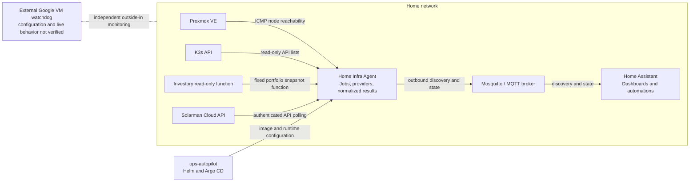
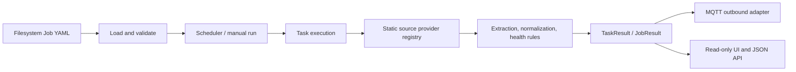

# Home Infra Agent: architecture and roadmap

**Purpose:** record the agent's role, system boundaries, current integrations, deployment shape, and the next useful extensions. This is a design document; live deployment and Home Assistant details are marked with the date or evidence level because they can change.

## Project intent

Home Infra Agent (HIA) is a small, configuration-driven collector for selected infrastructure and service facts that are useful on Home Assistant dashboards. It reads from bounded sources, normalizes results, and can publish them as MQTT Discovery entities. Its web page is an operational view for the same compact job results.

The agent is intended to connect existing systems, not replace them:

- Home Assistant owns household automations and dashboard presentation.
- Proxmox owns VM, cluster, and Ceph operations.
- Prometheus and related ops-autopilot monitoring own detailed Kubernetes metrics, history, and alerts.
- Investory owns financial data and database semantics.
- Solarman owns inverter telemetry and its cloud API.
- The external Google VM watchdog is intended to observe the home from outside the home network and alert independently.
- HIA collects selected facts from these systems and exposes them through a small, common result model.

HIA is read-only with respect to its sources. The MQTT adapter is outbound-only: it publishes availability, discovery configuration, and state. The UI's explicit **Run now** action requests a read-only collection run; it does not change source systems or configuration.

## System context

The dashed external-monitor relationship is conceptual. The watchdog's current probes, notification route, tunnel, and live status have not been confirmed from its host or configuration. HIA's MQTT path must not become the watchdog's only alert path.

## Internal architecture

- A **Job** owns its name, schedule, timeout, freshness policy, and optional MQTT device/entity metadata.
- Each YAML file beside `job.yaml` defines an independent **Task**. Task failures do not stop sibling Tasks or Jobs.
- A statically registered **provider** performs source-specific I/O and returns values to the shared result model. Provider code does not create HA entities or publish MQTT.
- Generic HTTP extraction and health rules are implemented in shared mapping code. Protocol-specific behavior remains in specialized providers.
- Job results are held in process memory. There is no database, long-term history, durable queue, or alerting service in HIA.
- A single MQTT publisher worker serializes broker operations, retains discovery/state, and republishes current discovery and results after reconnect. HTTP serving and MQTT publishing are separate outputs from the job result.

The main implementation boundaries are documented in the top-level [README](../README.md#implementation-ownership).

## Implemented source integrations

The following reflects the repository and dev configuration, not a fresh health check of every upstream service.

| Source | Provider and purpose | Current dev use | Deliberate boundary |
| --- | --- | --- | --- |
| Proxmox nodes | `ping`; bounded ICMP reachability | Three nodes, every 60 seconds; MQTT topic `home/proxmox` | This is not Proxmox API, quorum, VM, Ceph, or storage monitoring. |
| K3s | `kubernetes`; nodes, pods, Deployments, StatefulSets, and DaemonSets | Compact cluster/workload status, scheduled every 60 seconds in the chart | Uses a projected service-account token and a separate read-only ClusterRole limited to `list` on those resource types. No Secrets, ConfigMaps, logs, or Events. Detailed metrics/history remain with Prometheus. |
| Investory | `investory_postgres`; calls a fixed, read-only portfolio summary function | Portfolio 1 snapshot, weekdays 09:00–22:00 Europe/Warsaw; topic `home/investory/portfolio` | This is an explicitly approved portfolio snapshot feed, not a general financial-data bridge. The agent does not accept arbitrary SQL. A dedicated credential can execute the function; the provider uses a read-only transaction and timeout. The job publishes the latest row, not historical backfill. |
| Solarman | `solarman`; authenticated Cloud Open API and allowlisted normalized measurements | Hourly poll; source data older than 900 seconds is marked stale; topic `home/solarman` | Credentials are injected from a secret. Device serial is optional when discovery is unambiguous. This is not the HA integration implementation. Keep existing HA telemetry available while validating MQTT readings. |
| Configured HTTP | `http`; bounded GET/POST, optional environment-referenced auth, JSON extraction and health rules | Shipped as an example only; not enabled as a deployed job | No executable expressions, arbitrary response body storage, or disabled TLS verification. |

The actual schedules, entity metadata, and environment-variable names are in [`config/jobs/`](../config/jobs/) and the ops-autopilot Helm values. The health endpoint reported four loaded jobs and zero invalid jobs after the 2026-10-08 dev rollout; this is a dated observation, not a permanent guarantee.

### Result and freshness semantics

Tasks and Jobs use `OK`, `WARN`, `ERROR`, and `UNKNOWN`. Results include timestamps, duration, optional safe error text, and primitive values. Job aggregation retains task-qualified names and only emits a short alias when that field is unambiguous.

Freshness is separate from process availability and job status. A broker-connected agent can still have an old or failed source result. Per-job freshness and entity expiry prevent retained values from appearing current after collection stops. A stale or failed run clears prior known values from the retained state; exact status and source-age fields remain available for diagnosis.

## MQTT and Home Assistant boundary

MQTT is an **outbound adapter**. HIA does not subscribe to MQTT commands and does not accept control requests from HA. The adapter owns HA Discovery, stable device/entity identifiers, retained state, broker availability, and reconnect replay. Job providers and mapping logic do not depend on Home Assistant.

Home Assistant is the dashboard and household-automation layer and is maintained in the separate `as-sessions-hub` project. Owner-provided documentation dated 2026-10-06 describes separate Family Home, Tablet Home, and Infrastructure dashboards and existing integrations for Proxmox, Kubernetes, energy, heating, media, and other devices. That inventory is historical documentation, not a live integration or entity audit. The Tablet Home route is `http://192.168.1.67:8123/lovelace/tablet-home`; its rendered dashboard can be inspected through the HA UI, and the owner reports SSH access for inspecting saved configuration. Entity IDs and current source ownership still need to be mapped from a current HA export before replacing or duplicating cards.

The separate [`home-assistant/`](../home-assistant/) package estimates household gas and water use from editable baselines and meter readings. It runs inside HA and is not an HIA source or MQTT integration.

Good MQTT additions should fill a clear data gap, have a named source of truth, and present compact status or measurements that HA can use. Avoid mirroring every metric or creating duplicate entities for facts already provided reliably by an HA integration.

## Deployment and operations

The dev workload is managed in the adjacent [ops-autopilot repository](https://github.com/spider-su/ops-autopilot), under `applications/home-infra-agent/`, and registered by `clusters/dev/workloads/home-infra-agent.yaml`. Argo CD reads that repository's `main` branch. The chart provides a non-root, read-only-root-filesystem container, resource limits, health probes, NetworkPolicy, and a namespace quota.

As checked on 2026-10-08, the dev values pinned `aserobaba/home-infra-agent:sha-42f32571c7a10c14ed4be92542f9a612cdfe1c5c` at ops-autopilot commit `58a281fcfb7a0c92bfa6ce5c4619967121be09df`. The Argo Application was Synced/Healthy and the pod was Ready; `/health` reported MQTT connected, four loaded jobs, and zero invalid jobs. Re-check before operational use because image pins and cluster state change.

Runtime credentials are not stored in agent YAML or this repository. The dev chart obtains MQTT, Investory, and Solarman credentials through Kubernetes Secrets, including SOPS-managed material in ops-autopilot. The K3s identity is deliberately read-only. HIA's API and dashboard have no authentication of their own; expose them only through the intended private network and ingress controls.

The HA hostname ingress uses cluster ingress configuration plus Pi-hole/Traefik configuration maintained outside the GitOps repository. The exact external Traefik configuration is not versioned here. Do not assume an ops-autopilot change updates the Pi-hole host.

For releases, distinguish these checks: source/CI, successful image publication, immutable dev image pin, Argo sync, pod rollout, and observed HA/MQTT behavior. Roll back by restoring the previous image pin and runtime configuration through GitOps; do not delete retained discovery topics during routine rollback.

## Explicit non-goals and limits

- No infrastructure mutation, remote command runner, service restart, or general-purpose shell execution.
- No second Prometheus, time-series database, event history, alert manager, or Proxmox management plane.
- No arbitrary SQL endpoint or HA UI for submitting queries.
- No MQTT command subscription or dependence on HA for source collection.
- No durable job-result store; a process restart loses in-memory result history until jobs run again.
- No assumption that the external watchdog is configured correctly or currently alerting until its own host/configuration is checked.

## Roadmap

Items below are proposals, not implemented functionality. Choose an item only after confirming a concrete dashboard or operational use case.

### 1. Map existing HA entities to their owners

Export the current dashboard and entity registry. For each infrastructure card, record its entity ID, source integration, update rate, stale behavior, and whether it already uses HIA MQTT. Use this to remove duplicate summaries only after verifying the replacement entity in HA.

The agent already publishes compact Proxmox reachability and K3s workload summaries. Deeper Proxmox/Ceph status from `lab doctor` and an outside-in watchdog result are possible candidates only if they add information the current HA integrations and cards do not already provide. Keep energy, heating, weather, and household-device telemetry with their existing HA integrations where those sources work. The Investory portfolio feed is a separate, explicit exception described above.

### 2. Reuse `lab doctor` for missing Proxmox/Ceph facts

The supplied script excerpt shows read-only Proxmox API-token authentication and CA verification, but the complete script, JSON contract, and installed location were not part of this repository review. Inspect `./lab doctor`, its full output/schema, and its runtime location before choosing an integration. Prefer invoking an existing structured/read-only tool where it runs over writing a second Proxmox API client. Add only gaps such as quorum, Ceph, or storage health that are not already covered by HA or Proxmox's own views.

### 3. Generalize SQL only for a second approved use case

Investory's current provider is intentionally fixed to an approved function. A reusable SQL source adapter may make sense when another concrete read-only source is selected. Keep SQL and query shape controlled by configuration/code review, use dedicated least-privilege credentials, bounded result sizes and timeouts, and never expose arbitrary SQL through the HA API.

### 4. Add a constrained CLI source if `lab doctor` needs a bridge

No generic CLI provider exists. If the script is installed alongside HIA, a future provider could invoke an allowlisted executable with fixed arguments, no shell, bounded execution time/output, and structured JSON parsing. Do not move a Google VM-local script into K3s without confirming where it runs and which network/API access it requires.

### 5. Evaluate an external watchdog heartbeat independently

The Google VM can potentially receive an authenticated, timestamped summary after a completed K3s health run. This could reduce inbound SSH polling if SSH is used only for that purpose, but the watchdog setup and SSH uses are not yet verified. A future heartbeat should carry job result/freshness, use authenticated HTTPS, reject stale/replayed data, expose only a small summary, and preserve the watchdog's independent notification route and outside-in service probes. MQTT publication to HA is not a substitute for external alerting.

### 6. Consider further source/output adapters only when needed

Current source providers are `ping`, `http`, `kubernetes`, `investory_postgres`, and `solarman`; MQTT is the outbound adapter. There is no generic SQL adapter, CLI adapter, or multi-sink dispatcher. Keep the normalized result contract and scheduler shared if more adapters are added. Each new adapter should have a specific owner, a bounded contract, and failure isolation so one destination does not suppress another.

### 7. Optional Scrutiny summary

Only consider a compact disk-health warning if there is a clear HA use case and a supported read-only source path. Preserve Scrutiny as the detailed SMART/history owner, publish source timestamp/freshness, and do not infer full disk health from a temperature alone.

## Evidence and maintenance

Treat the following separately when updating this document:

- **Implemented:** confirmed by code and committed configuration.
- **Configured:** present in GitOps/runtime configuration, but not necessarily recently healthy.
- **Observed:** checked live with a timestamp.
- **Proposed/unverified:** design only, or external state not inspected.

Refresh dated HA, cluster, image, and watchdog facts before using them for an operational decision. Keep secrets, tokens, and credential values out of this document.
